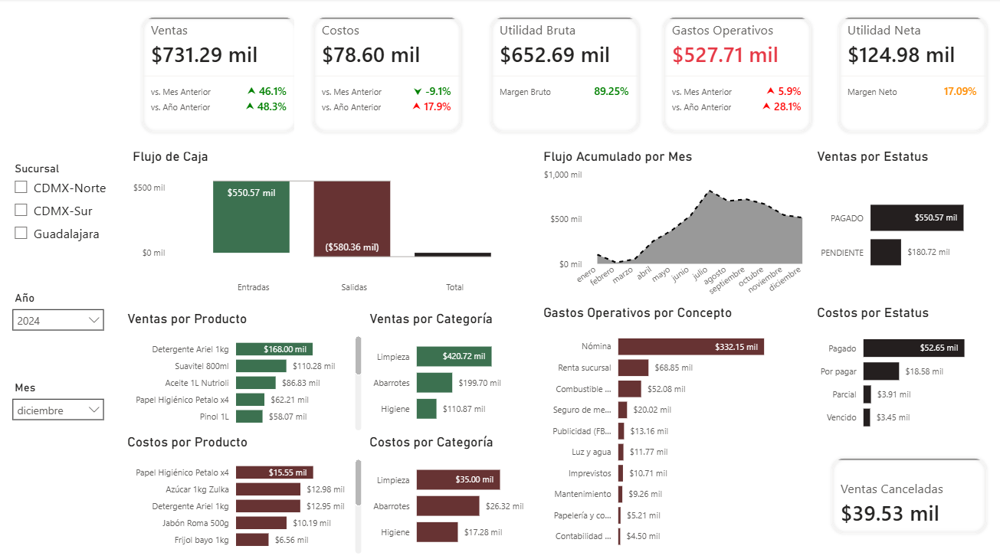

# Dashboard de análisis financiero para distribuidor mayorista



P&L, flujo de caja y márgenes por sucursal para una distribuidora mayorista 
de abarrotes con 3 sucursales. Proyecto freelance de BI desarrollado en Python, 
Power Query y Power BI.

→ **[Caso completo en Notion](https://app.notion.com/p/Dashboard-de-an-lisis-financiero-para-distribuidor-mayorista-365b7682d7a780808311d39841913f80)** — problema, proceso, medidas DAX y resultados.

---

## Estructura del proyecto

```
dashboard-finanzas-sucursales/
│
├── data/
│   ├── _raw/                          # Archivos originales del cliente
│   │   ├── ventas_CDMX_aspel_export.xlsx
│   │   ├── ventas_GDL_lupita_manual.xlsx
│   │   ├── gastos_operativos_dueño.xlsx
│   │   └── compras_proveedores.xlsx
│   │
│   └── processed/                     # Plantillas limpias y estandarizadas
│       ├── ventas_CDMX.xlsx
│       ├── ventas_GDL.xlsx
│       ├── gastos_operativos_CDMX_Norte.xlsx
│       ├── gastos_operativos_CDMX_Sur.xlsx
│       ├── gastos_operativos_Guadalajara.xlsx
│       └── presupuestos.xlsx
│
├── notebooks/
│   └── clean_data.ipynb               # Perfilado y limpieza de datos
│
└── reports/
    └── dashboard_dist_rojas_hermanos.pbix
```
